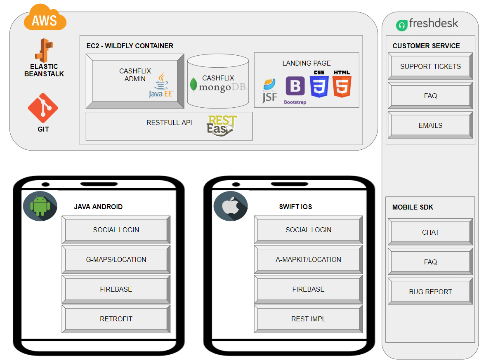

# CashFlix #
* [www.cashflix.com.br](https://www.facebook.com/CashFlix/)

CashFlix is a cashback program for retail and local market, users earn money rewards in daily shop at groceries, supermarkets, bakeries etc.

### Platform Modules ###

* CashFlix-Admin:
Server backend with resources, REST APIs, and administrative tools.
* CashFlix-LandingPage:
Landing page with product details and comercial contacts.
* CashFlix-Android:
Android native mobile app to users.
* CashFlix-iOS:
iOS native mobile app to users.

### Stacks & Frameworks ###

* CashFlix-Admin:
Java-EE, JSF, MongoDB noSQL, RestEasy, JSON, WildFly.
* CashFlix-LandingPage:
Java JSF, JavaScript, Html, Bootstrap e CSS.
* CashFlix-Android:
Google Maps/Location, Firebase, Picaso, REST Retrofit, Facebook SDK, MobiHelp Support.
* CashFlix-iOS:
Apple MapKit/Location, Firebase, KingFisher, REST, Facebook SDK, MobiHelp Support.

### Infra & DevOps ###

* Backend \ Landing Page provisioned on AWS EC2 with Elastic Bean Stalk hooked to Git
* Mobile apps manually deployed on app stores

### Architecture ###

### Demo ###

### Contribution guidelines ###

* This a public demonstration, forks and contributions are in another private repository.

### Contact ###

* [vinicius@cashflix.com.br](mailto:vinicius@cashflix.com.br)
